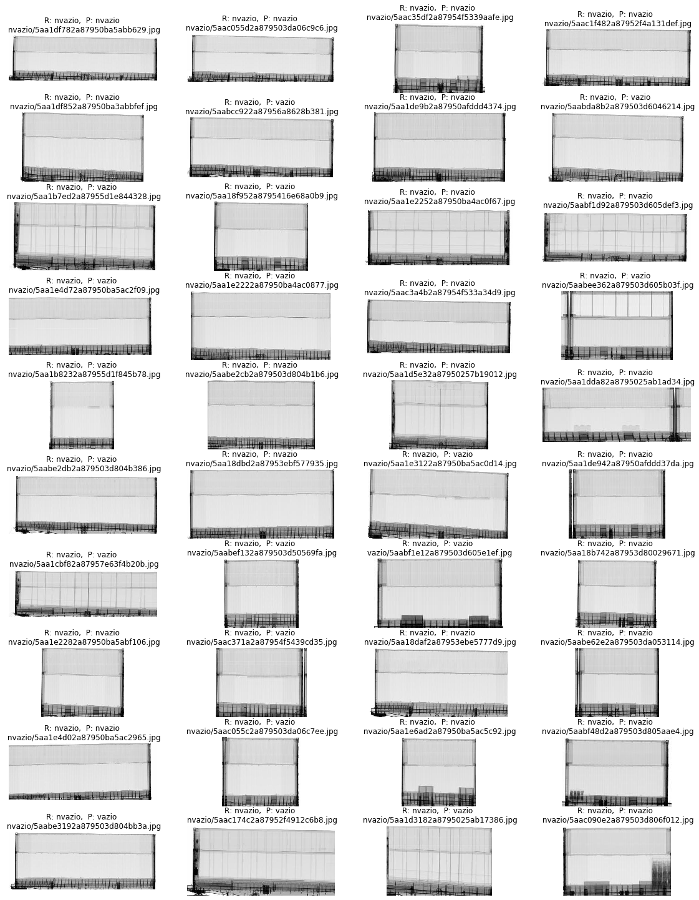

# Conclusões

## Observações

Foram utilizadas várias técnicas e realizadas diversas iterações/melhorias dentro das técnicas, sucessivamente.

Além disso, paralelamente, testes parecidos foram realizados em bases diferentes para testar generalidade do modelo.

## Base ChestXRay

Conforme era esperado, esta base se mostrou mais difícil de trabalhar do que a base de escaneamento de 
contêineres para classificar vazio/ não vazio

Considerou-se que para este tipo de problema o mais importante é um recall alto para pneumonia.

O modelo final tem um recall excelente, embora o desejável neste caso seja 100%, não sabemos se há
erro de rotulagem nem qual o erro humano, muito menos o Bayes Error. Portanto, não dá para saber se 
é factível melhorar acima de 95-97% de recall. 

Não foi possível obter ganhos significativos em relação ao baseline com as técnicas empregadas. 
A melhoria foi marginal, de menos de 5% em relação à rede neural simples. Tabela abaixo.

REDE 01b
Accuracy:           acc 0.95 val_acc 0.85
recall pneumonia:       0.94         0.95
REDE 02e
Accuracy:           acc 0.95 val_acc 0.89
recall pneumonia:       0.96         0.97

A diferença entre treinamento e validação demonstra uma variância grande, mas pelos testes na base seria importante checar
se não se trata de um  *data mismatch*. 

Esta base parece ter problemas de balanceamento e também de distribuição. Como
próximo passo, seria interessante fundir todos os exemplos da base orginal (train, val, test) em uma base única e fazer um
*resample* das bases de treinamento e validação, rodando cópias destes notebooks e comparando os resultados. Além disso,
testar técnicas adicionais de *image augmentation* e balanceamento de classes (parâmetro *class weight* ou aumento de uma
categoria).

## Base Vazios

Nesta base também considerou-se que o mais importante seria obter um recall alto, reconhecendo principalmente
contêineres declarados como vazios mas contendo carga. 

Os resultados da rede simples treinada do zero foram similares ao uso de rede DenseNet, 
mas a extração de features com rede pré treinada na imagenet pode ser um método universal
 base para vários classificadores, buscas e análises.
 
Assim, quando uma imagem entrar no Banco de Dados, pré extrair as features via uma rede pré treinada,
 salvando no Banco de Dados, pode servir como ponto de entrada para vários tipos de classificadores e 
 comparações, salvando memória e processamento posterior.
 
Os resultados utilizando maxpool e avgpool como extrator de características foram muito similares, com
leve vantagem para avgpool nos resultados e menor tempo de convergência. 

Os melhores resultados obtidos foram de 96% de accuracy e 96% de f1-score, sendo que a base parece ter 
em torno de 2% de erros de rotulagem. Com a base limpa, o resultado subiu a quase 98%.
Embora pela visualização haja espaço para melhora (alguns contêineres não vazios com muito pouca carga
mas facilmente identifiáveis pelo olho humano classificados como vazios), o modelo está muito próximo de um
candidato a colocação em produção. Outro ponto interessante é que foi demostrado ser possível utilizar
um classificador extremamente simples e rápido, que utiliza como ponto de entrada apenas 1024 números que
podem ser pré-extraídos das imagens pela rede DenseNet121 e ocupa apenas 14MB de RAM por batch. 

Neste problema, a rede Siamesa treinada também apresentou resultados excelentes. Utilizar redes siamesas para 
classificação adiciona uma complexidade: como a rede sempre compara duas imagens, não há uma rede treinada para
simplesmente fazer a classificação da imagem, mas sim dar um número (próximo de zero para itens iguais ou 
da mesma classe, próximo de 1 para itens diferentes). Optou-se por comparar a imagem a ser classificada com
duas imagens: uma da classe 0 e outra da classe1. A que retornar menor número é considerada a correta.

Baseline SVM

             precision    recall  f1-score   support

          0     1.0000    0.9117    0.9538      1166
          1     0.9179    1.0000    0.9572      1151

Rede 01b3 (baseline simples)

             precision    recall  f1-score   support

          0     1.0000    0.9245    0.9608      1166
          1     0.9290    1.0000    0.9632      1151

Rede 02c3 (*Features* da DenseNet121 treinada na Imagenet)

             precision    recall  f1-score   support

          0     0.9900    0.9297    0.9589      1166
          1     0.9329    0.9904    0.9608      1151

Rede Siamesa 

           precision    recall  f1-score   support

        0.0     0.9972    0.9228    0.9586      1166
        1.0     0.9273    0.9974    0.9611      1151

 

Mais do que apenas ver os números, seria interessante visualizar e entender os erros que
cada modelo está cometendo. Assim, no notebook 05 comparei também os erros de cada modelo 
entre si. A divergência maior foi entre o modelo 1 e os demais, chegando a 3%. Os modelos de
redes neurais possuem menos de 1,5% de divergência entre os erros e acertos. Isso indica comprovação
parcial da teoria de que: 1. Há erros de rótulo, 2. Há exemplos muito difíceis ou no limiar.

Para lembrar, no início do treinamento o modelo cometia erros como os abaixo, classificando contêineres
claramente não vazios como vazios, mas com probabilidade baixa (65% ou menos, sendo que 50% é o limiar para
classificação na outra classe).

Já os últimos modelos estão cometendo os erros mostrados abaixo. Note-se que o SVM comete erros "bobos". Já os erros de rede
neural, especialmente os com recall mais alto, quase em 100% das vezes fica difícil de saber se é erro de rótulo, pois a visualização
também indica um contêiner sem carga.

* Erros SVM

* Erros Rede Neural Simples

* Erros DenseNet Transfer Learning

* Erros DenseNet Transfer Learning com class weights
[Erros 3a](images/erros_3a.png)

* Erros Siamesa

 

### Desempenho (em tempo e consumo de memória)

Devido à grande dimensionalidade do problema, a solução SVM ocupa bastante memória e é a que tem maior tempo de 
execução (em computador que possui GPU, provavelmente sem GPUs as redes neurais teriam desempenho muito inferior)
 Em seguida a rede DenseNet pré treinada é a que tem maior uso de memória. A rede neural simples possui o menor uso de
 memória de todas e maior rapidez. A rede siamesa utiliza memória intermediária mas se mostrou mais lenta que a rede imagenet,
 pois precisa extrair features de duas imagens para depois fazer comparações.
 
 
 Tempos para carregar do disco, redimensionar e fazer predicões em 2317 imagens:
 
    Nome da técnica             tempo           Consumo de memória          GPU(1) 
    Rede DenseNet121            2min 35s            Alto                    Não
    SVM                         1min 37s            Alto                    Não
    Rede DenseNet121            25.2 s              Alto                    Sim
    Rede neural simples 01b3    22.2 s              Alto                    Não
    Rede siamesa(2)             15.4 s              Médio                   Sim
    Rede neural simples 01b3    9.15 s              Médio-baixo             Sim
    Tratar 1024 features(3)      43 ms              Baixo                   Não
    Tratar 1024 features(3)      126 ms             Baixo                   Sim
    Tratar 128 features(3)      <10 ms              Muito baixo             Sim

1. GPU não é estritamente necessária para predição de redes neurais, mas em uma predição de rede neural,
 especialmente uma rede convolucional, o tempo é muito maior sem utilização de GPU. Para este teste foi utilizada
 CPU Intel i5 com 2.30ghz e 8 cores, cache L1 32K, L1 256K e L3 8192K e NUMA mode. A GPU utilizada foi uma GTX1050ti 4GB,
 cuda 10.1. Memória do Sistema de 8GB. 
 
2. A rede siamesa precisa sempre passar duas imagens, por isso o tempo é maior que 01b3. Para melhorar a precisão,
poderiam ser comparadas vários pares de imagens, e os tempos serão somados

3. Desde o começo do projeto uma das idéias que saem do padrão de simplesmente treinar um classificador do iníco ao 
fim é reutilizar os aprendizados de uma etapa em outra. Assim, caso as imagens estejam em uma base centralizada,
uma boa prática que quase nunca é vista nos *papers* ou tutoriais seria fazer pré extração de *features* em batch e utilizar,
posteriormente, estas *features* ao invés de carregar a imagem original. É uma redução entre 2.400 a 20.000 vezes (de 
uma imagem SVGA para 1.024 ou 128 floats por exemplo). Assim, economiza-se disco, I/O, processamento, memória, 
energia elétrica e a redução drástica do tempo de processamento possibilita inclusive fazer tarefas 
muito mais complexas, como uma busca de similaridade em todo o banco de dados ou agrupamento
(clusterização) das imagens.