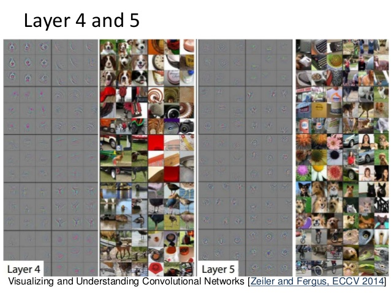

# Exploração

## BASE ChestXRay

A base chestXRay é composta de 5216 imagens na base de treinamento e 624 imagens na base teste.

São imagens de raio X de tórax, rotulados como paciente NORMAL e paciente com PNEUMONIA.

A base é levemente desbalanceada, havendo quase 3 vezes mais exemplos de pneumonia.

## BASE Vazios 
 
Esta base é composta por 20845 imagens de treinamento e 2317 imagens de validação. A base é balanceada.

São duas categorias: nvazio - contêineres contendo algum tipo de carga, mesmo que mínimo,
e vazio - contêineres vazios.

Foram inseridos propositalmente, somando à extração aleatória, 3000 imagens de contêineres 
de "classificação difícil", imagens que algoritmos anteriores falharam para classificar.

Além disso, durante a exploração, foram descobertas em torno de 2,5% de imagens rotuladas erradamente
e 2% de imagens que mesmo a visão humana teria dificuldade de saber se está vazio ou não.

Assim, como o melhor desempenho obtido foi próximo de 98% para base "limpa" e de 96% 
para base completa (ver detalhes no relatório detalhado e nos respectivos notebooks)
pode ser considerado que para esta tarefa foi obtido um classificador excelente.

   

## BASE NCMs únicos

Esta base é composta de 41809 imagens de 868 categorias.
 
São imagens de inspeção não invasiva de contêineres.   

# Benchmark

O primeiro modelo a ser treinado será sempre uma rede convolucional bem simples. 

Além disso, na base Vazios, há um modelo em produção, uma SVM, que poderá ser comparada.

As redes neurais convolucionais são hoje o "estado da arte" em visão computacional. As camadas convolucionais aprendem
a aplicar filtros em diversas regiões das imagens, destacando formas, texturas, linhas, de acordo com a necessidade da
tarefa em que estão sendo treinadas.  As convoluções são aplicadas consecutivamente, em objetos cada vez maiores, porque
as imagens são progressivamente filtradas por convuluções, ou mais comumente por camadas de *pooling* que diminuem o tamanho
da entrada, destacando partes mais importantes, e os filtros das convoluções mais profundas combinam então os destaques 
dos filtros predecessores. Nas últimas camadas, estes mapas de características descobertos pelas convoluções são combinados
em uma rede neural convencional conectada para utilização na tarefa de classificação.

Como a rede neural é um aproximador de funções universal, através de *backpropagation* e gradiente descendente esta consegue
derivar os pesos necessários para a tarefa de classificação treinada, desde que adequada projetada e treinada. 

Antes do advento das redes neurais, os algoritmos que costumavam obter melhores resultados em classificação de imagens
eram as Suport Vector Machines - SVMs. As SVMs podem utilizar diversos "kernels" para a tarefa de classificação, tendo sido o 
*kernel* RBF utilizado com sucesso durante décadas, antes da rede AlexNet ter baixado em mais de 10 pontos percentuais o 
erro no desafio AlexNet, antes dominado por SVMs. O kernel rbf funciona procurando várias funções gaussianas, em cada dimensão,
que separem por uma margem específica, que é um hiperparâmetro do kernel, a maior quantidade de exemplos das classes.

Assim, os baselines utilizados serão um kernel RBF já em produção e uma rede neural extremamente simples e rápida para treinar. 
Em seguida, será utilizada a rede DenseNet121 que apresenta um bom equilíbrio entre resultados comprovados em bases difíceis,
consumo de memória e complexidade computacional, com a técnica de *Transfer Learning*. Em seguida, será treinado um modelo 
de rede siamesa. Todos os modelos serão avaliados paralelamente conforme seção métricas.

# Metodologia

## Pré processamento de dados

Está sendo utilizado o pacote PIL ou o ImageDataGenerator(que usa pacote PIL) do keras para abertura das imagens
 e redimensionamento com ANTALIAS.
Os valores RGB originais estão sendo reescalados dividindo por 255. Além disso foram testadas diversas opções de Image
 Augmentation.
 
No caso da base Vazios, foi detectado erro de rotulagem e automaticamente gerada uma base filtrada através de threshold
 em um dos classificadores treinados.
 
 Os detalhes do pré processamento e principalmente da execução estão nos Notebooks. Resumo/índice no próximo item.

## Análise 

Para obter melhores resultados, serão provavelmente necessárias a utilização de técnicas adicionais, conforme citado anteriormente:

**Tranfer Learning:** 

Consiste em utilizar pesos que representam conhecimento acumulado/aprendido por uma rede neural em domínio similar.
Assim, existem redes que são referências em *papers* publicados, representando avanços tecnológicos, e que foram treinadas em 
milhões de imagens, como na base ImageNet (http://www.image-net.org/).

Estas redes são treinadas por semanas, nestes milhões de imagens, aprendendo a "ver" formas, linhas, texturas, etc. Através do
uso das primeiras camadas destas redes, excluindo apenas as últimas, responsáveis pela classificação, podemos extrair um resumo
de todo esse aprendizado e transferir este conhecimento para uma nova tarefa.

**Image Augmentation:**

Como temos relativamente poucos exemplos, uma forma de melhorar o aprendizado e principalmente evitar sobreajuste é aplicar 
pequenas modificações aleatóriamente na base de treinamento. Assim, simulamos o treinamento com uma base maior.

O keras possui diversas funções já pré preparadas para conseguir realizar esta tarefa com facilidade (https://keras.io/preprocessing/image/).

Podem ser aplicados zooms, recortes, mudança de brilho, espelhamento, pequenos deslocamentos laterais, entre outros. Deve se ter em
mente o domínio do problema, para não realizar tranformações que prejudiquem o aprendizado. Por exemplo, se o objeto a ser detectado
tem um tamanho ou posição fixos, usar recorte ou zoom seria inadequado e mesmo os deslocamentos não podem ser grandes. 

**Siamese networks:**

As redes siamesas são em tudo iguais às redes convolucionais normais, exceto por uma particularidade: você sempre passa duas imagens
pela mesma rede e no final compara as saídas. Com isso, a rede aprende uma função de similaridade, podendo ser utilizada para reconhecer
objetos que não estavam na base de treinamento, desde que pertençam ao mesmo domíno. Junto com as GANs, são um avanço interesssante sobre
as redes neurais convencionais, podendo ajudar a resolver a imensa fome por dados para treinamento. Mas, assim como as GANs, são um pouco
mais difíceis de treinar e utilizar.

Como aprendem uma função de similaridade, redes siamesas podem aprender um melhor *embedding* da imagem (os números que estarão na última camada 
e representam tudo que foi "visto" pelas camadas convolucionais) e podem ser utilizadas para buscas de similaridade, One Shot Learning,  
para lidar com classes desbalanceadas e até para fazer acompanhamento visual de objetos (object tracking).

[One Shot Learning](https://www.cs.cmu.edu/~rsalakhu/papers/oneshot1.pdf)

[Signature Verification](https://papers.nips.cc/paper/769-signature-verification-using-a-siamese-time-delay-neural-network.pdf)

 
## Implementação e refinamento

Ver próximo item, que resume os achados de cada notebook utilizado.  
