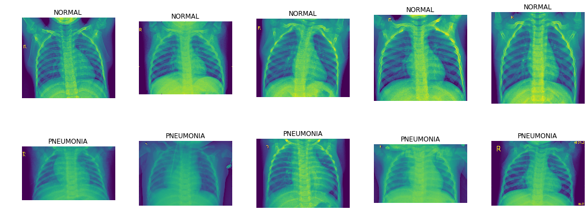
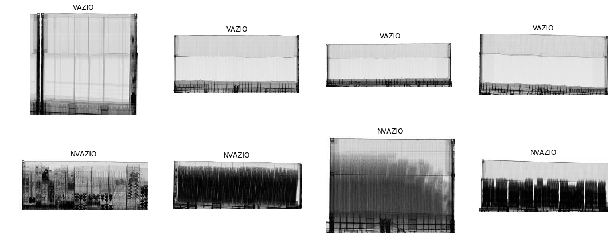

# BASE ChestXRay

A base chestXRay é composta de 5216 imagens na base de treinamento e 624 imagens na base teste.\

São imagens de raio X de tórax, rotulados como paciente NORMAL e paciente com PNEUMONIA.

A base é levemente desbalanceada, havendo quase 3 vezes mais exemplos de pneumonia.

# BASE Vazios 
 
Esta base é composta por 20845 imagens de treinamento e 2317 imagens de validação. A base é balanceada.

São duas categorias: nvazio - contêineres contendo algum tipo de carga, mesmo que mínimo,
e vazio - contêineres vazios.

Foram inseridos propositalmente, somando à extração aleatória, 3000 imagens de contêineres 
de "classificação difícil", imagens que algoritmos anteriores falharam para classificar.

Além disso, durante a exploração, foram descobertas em torno de 2,5% de imagens rotuladas erradamente
e 2% de imagens que mesmo a visão humana teria dificuldade de saber se está vazio ou não.

Assim, como o melhor desempenho obtido foi próximo de 98% para base "limpa" e de 96% 
para base completa (ver detalhes no relatório detalhado e nos respectivos notebooks)
pode ser considerado que para esta tarefa foi obtido um classificador excelente.

   

# BASE NCMs únicos

Esta base é composta de 41809 imagens de 868 categorias.
 
São imagens de inspeção não invasiva de contêineres.   

